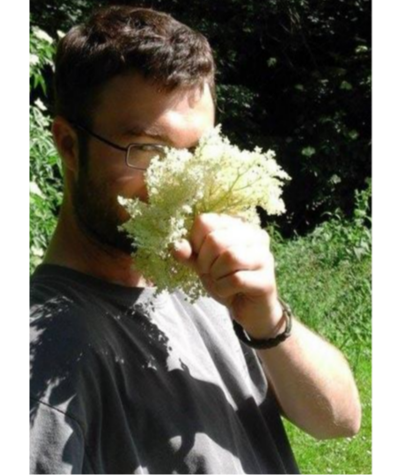



Hi! I am Thomas, a **passionate science guy** with a variety of technical expertise
and mentoring skills to offer. I love to work with people from diverse backgrounds, learn
about their projects, help __design experiments__, and provide guidelines for data analyses.
> try\\
**1st**,  \\
**2nd**, \\

try
